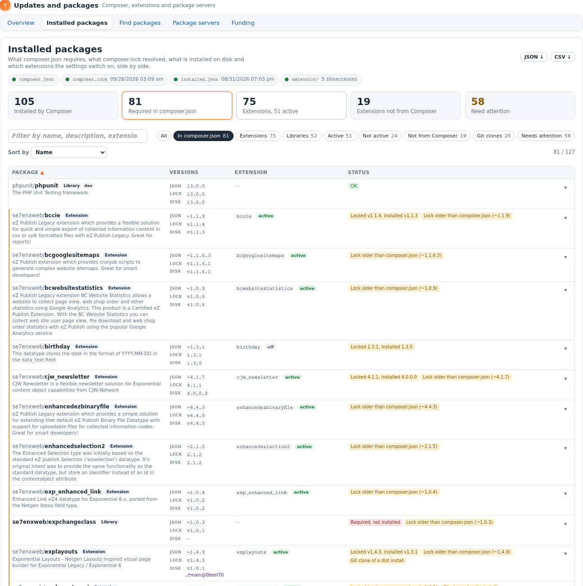
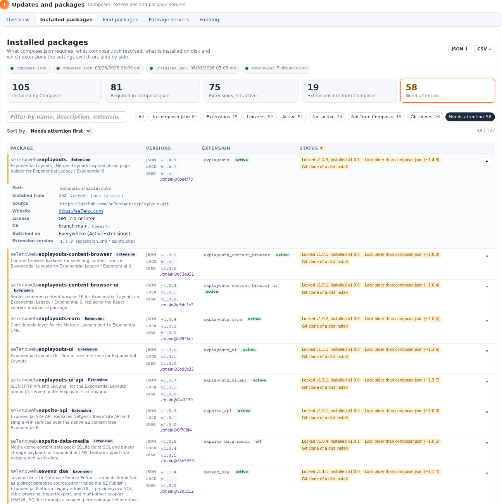

eZ Update
=========

**The package manager for Exponential: Composer, packagist.org, your extensions
and your package servers, in the admin and on the command line.**

[](https://packagist.org/packages/se7enxweb/ezupdate)
[](LICENSE.md)
[](composer.json)
[](https://exponential.earth)

An Exponential installation is a few dozen Composer packages, a few dozen
extension directories and a handful of settings that decide which of them run.
eZ Update puts all of that on one screen, keeps it honest, and lets you update
and install packages from the admin with the same guard rails you would use on
the command line: a check that changes nothing, a dry run, a backup
confirmation, and Composer's own output as it runs.



Why eZ Update
-------------

- **See the truth, not a guess.** `composer.json` says what you asked for,
  `composer.lock` says what was resolved, `vendor/composer/installed.json` says
  what is on disk, and `site.ini` says which extensions actually run. eZ Update
  reads all four and tells you, package by package, where they disagree.
- **Update without fear.** Updating and installing are off until you switch them
  on. Every run offers a dry run first, asks you to confirm that a backup exists,
  runs in the background (no web request time limit), and shows Composer's
  output live, in colour.
- **One tool, two front ends.** Everything the admin pages do, the command line
  does too, with the same settings and the same lists. Runs started on one show
  up on the other.
- **Made for Exponential.** It knows extension directories, `ActiveExtensions`
  and `ActiveAccessExtensions`, the `.ezpkg` package servers the setup wizard
  uses, and the admin3 design it lives in.
- **Free software.** GPL v2 or later, no service to sign up for, no telemetry:
  it talks to packagist.org and to the servers you list, nothing else.

Features at a glance
--------------------

| | |
|---|---|
| **Overview** | Where Composer is and which PHP runs it, whether updating and installing are allowed, a check for updates (`composer outdated`) that changes nothing, an update dry run, a guarded update, and the recent runs. Cards count the installed packages, the extensions and what needs attention. |
| **Installed packages** | Every Composer package and every extension directory in one list: the `composer.json` constraint, the locked and the installed version, the git branch and commit of a working copy, the extension and where it is switched on. Mismatches are named. Filter, search, sort, open a row for details, share a filtered view by its address, download as JSON or CSV. |
| **Find packages** | Search packagist.org (Exponential extensions by default, any type on request) or every server in `composer.json`. A package page shows its versions, requirements, license, downloads, source and, when installed, how it was fetched and the state of its git working copy. Install from there. |
| **dist or source** | Install from release archives (fast) or as git clones with their history, so a package's branch and commit can be read and worked on; or let Composer decide. Per run. |
| **Package servers** | The Composer `repositories` of `composer.json` (packagist.org can be switched off) and the Exponential `.ezpkg` package servers the setup wizard reads; fetch a `.ezpkg` into the local package repository. |
| **Live runs** | Updates and installs run in the background, one at a time. The run page follows Composer's output as it is written; any run can be run again, and a dry run can be run for real. |
| **Funding** | Who the installed packages ask to be funded by, as `composer fund` prints it, read from their metadata and `.github/FUNDING.yml`; as a page, as JSON and as text. |
| **Command line** | `php extension/ezupdate/bin/php/ezupdate.php` with `status`, `installed`, `outdated`, `search`, `show`, `servers`, `packages`, `fetch`, `require`, `update`, `jobs`, `fund`. |

Screenshots
-----------

| Overview | A package |
|---|---|
|  |  |
| **What needs attention, one row opened** | **A run, followed live** |
|  |  |
| **Find packages** | **Package servers** |
|  |  |

The pages adapt to the room they get: between the admin's two side panels each
package becomes a card ([narrow layout](doc/images/installed-narrow.png)).

Quick start
-----------

```sh
# 1. Install the extension into your Exponential installation
composer require se7enxweb/ezupdate

# 2. Switch it on (settings/override/site.ini.append.php)
#    [ExtensionSettings]
#    ActiveExtensions[]=ezupdate

# 3. Refresh the autoloads and the caches
php bin/php/ezpgenerateautoloads.php --extension
php bin/php/ezcache.php --clear-all

# 4. Open the admin: Setup > Updates and packages
```

Administrators see it at once. To let other roles in, give them the
`update/ezupdate` policy (look, check, dry run) and, where they may change the
installation, `update/manage`.

Updating and installing from the admin stay **off** until you set
`[UpdateSettings] AllowUpdate=enabled` and `AllowInstall=enabled` in
`settings/override/ezupdate.ini.append.php`. The full walk-through is in
[doc/INSTALL.md](doc/INSTALL.md).

Documentation
-------------

| Guide | What is in it |
|---|---|
| [Installation](doc/INSTALL.md) | Requirements, installing, activating, permissions, first run, upgrading, removing. |
| [User guide](doc/USER_GUIDE.md) | Every page of the admin, step by step: checking, dry runs, updating, installing, servers, runs, funding. |
| [Installed packages](doc/INSTALLED_PACKAGES.md) | How the inventory is built, every column and status explained, filters, shareable addresses, the JSON and CSV downloads. |
| [Configuration](doc/CONFIGURATION.md) | Every setting of `ezupdate.ini`, with its default and when to change it. |
| [Command line](doc/COMMAND_LINE.md) | Every command, its options and what it prints; using it in scripts and cron. |
| [Security](doc/SECURITY.md) | What eZ Update may do, what it never does, and how it is guarded. |
| [Architecture](doc/ARCHITECTURE.md) | Classes, views, templates, the background runs and how to extend it. |
| [FAQ](doc/FAQ.md) | Answers to the questions that come up first. |
| [Changelog](doc/CHANGELOG.md) | What changed in each release. |
| [Contributing](CONTRIBUTING.md) | How to report a problem, propose a change and send a pull request. |
| [Roadmap](doc/TODO.md) | What is planned next, and where help is welcome. |

Requirements
------------

- Exponential 6 (the extension also runs on the legacy kernel it grew from).
- PHP 7.4 or later (tested up to PHP 8.5), with `proc_open`, and `curl` for
  fetching pages and packages.
- Composer 2 on the server, or a `composer.phar` (found on its own; see
  `[ComposerSettings]`).
- The admin3 design for the best look; admin2 works.
- Runs under PHP-FPM, Apache mod_php and persistent-worker servers such as
  Exponential Velocity.

Safety in one paragraph
-----------------------

Nothing changes the installation unless an administrator switched it on, chose
it, and confirmed a backup. Composer is started without a shell, with checked
arguments, a time limit and its own `COMPOSER_HOME`; server addresses must be
`https://`; every form carries the form token; Composer's output is escaped
before it is coloured. Read [doc/SECURITY.md](doc/SECURITY.md) for the details.

Get involved
------------

eZ Update is developed in the open at
[github.com/se7enxweb/ezupdate](https://github.com/se7enxweb/ezupdate). Bug
reports, ideas, translations and pull requests are welcome: start with
[CONTRIBUTING.md](CONTRIBUTING.md). The interface is translated into English and
German; adding a language is one file (`translations/<locale>/translation.ts`).

License
-------

eZ Update is free software: GNU General Public License v2.0 (or any later
version). See [LICENSE.md](LICENSE.md). Copyright 7x and the Exponential community;
the extension skeleton is by Serhey Dolgushev (see [doc/CREDITS.md](doc/CREDITS.md)).

Issues: https://github.com/se7enxweb/ezupdate/issues
