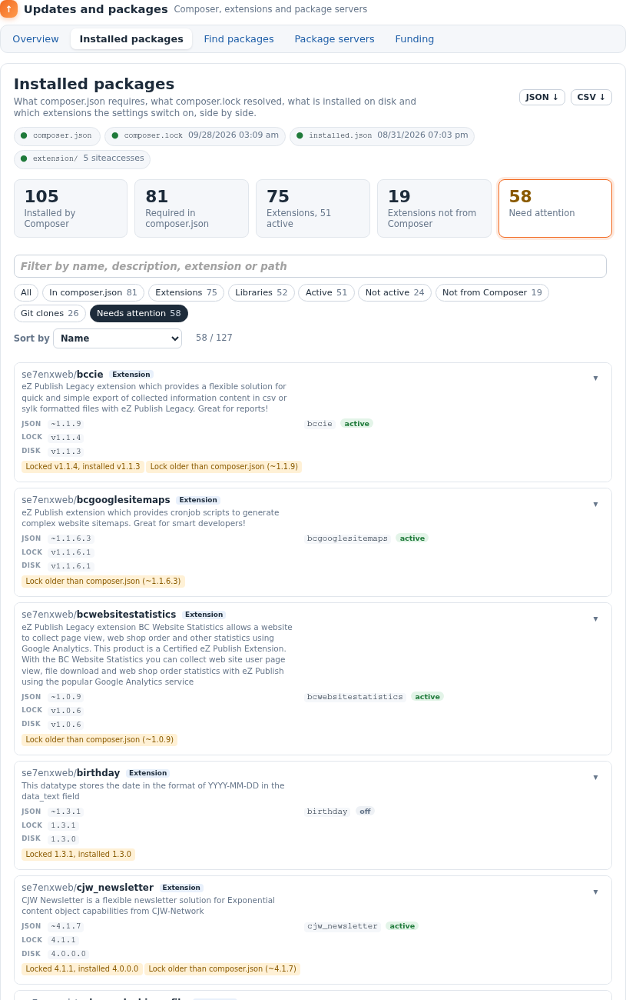

Installed packages
==================

`update/installed` answers one question: **what is really installed here, and
does everything agree?**


Where the information comes from
--------------------------------

Four sources, read from disk on every page view. Nothing is run, nothing is
written, and no network is used; a hundred packages take about a fifth of a
second.

| Source | Says |
|---|---|
| `composer.json` (`require`, `require-dev`) | what you asked for, and with which constraint |
| `composer.lock` (`packages`, `packages-dev`) | what Composer resolved those constraints to, and the commit |
| `vendor/composer/installed.json` | what is installed, where (`install-path`), from which commit, as dist or source |
| `extension/` and the settings | every extension directory; which ones `ActiveExtensions` (everywhere) or a siteaccess's `ActiveAccessExtensions` switch on |

A git working copy's branch and commit are read from its `.git` directory
(`HEAD`, the ref, `packed-refs`; worktrees too) without starting git.

The sources' state is shown at the top of the page: a green dot for each file
that was found and read, with the date of the lock and of `installed.json`.

One row per thing
-----------------

- every package in `installed.json`;
- every package `composer.json` requires that is not installed;
- every directory in `extension/` that Composer did not install (copied by
  hand, a git clone, part of the kernel);
- every extension the settings switch on that has no directory.

Packages that install into `extension/<name>` are matched to that directory, so
an extension is one row whether you think of it as a package or as a directory.

The columns
-----------

| Column | Shows |
|---|---|
| **Package** | the package name (vendor in grey), its kind (*Extension*, *Library*, *Plugin*), *dev* for `require-dev`, and its description. A Composer package links to its package page. Directories Composer did not install are named `extension/<name>`. |
| **Versions** | *json*: the constraint in `composer.json`, or *dependency* when another package pulled it in, or *not from Composer*; *lock*: the locked version; *disk*: the installed version (for a directory: the version in its `extension.xml` or `ezinfo.php`) and, for a git working copy, `branch@commit`. |
| **Extension** | the extension directory and where it runs: *active* (ActiveExtensions), *N siteaccesses* (ActiveAccessExtensions; hover for which), or *off*. |
| **Status** | *OK*, or what does not agree (below). |
| **▾** | opens the row: path, how it was installed and from which commit, the lock's commit, source URL, website, license, git branch and commit, where it is switched on, the extension's own version. |

What "needs attention" means
----------------------------

| Status | Meaning | Usually |
|---|---|---|
| **Required, not installed** | `composer.json` names it, `installed.json` does not have it | a `composer install` / `update` that did not run, or the package was removed by hand |
| **Not in composer.lock** | installed, but the lock does not list it | the lock was replaced or edited; run `composer update --lock` |
| **Locked X, installed Y** | the lock and the disk disagree on the version | `composer install` has not been run since the lock changed |
| **Lock older than composer.json (C)** | the locked version is below the lowest version constraint C allows | `composer.json` was raised but `composer update` was not run |
| **Other commit than the lock** | same version, different commit | a branch moved, or a dev version |
| **Missing on disk** | `installed.json` points to a directory that is not there | deleted by hand |
| **Active, but not on disk** | the settings switch on an extension that does not exist | a leftover in `site.ini`; the site logs warnings |
| **Git clone of a dist install** | Composer installed an archive, but the directory is a git clone | someone cloned over it; the next `composer update` will replace the clone |

The constraint check understands `~1.4`, `^1.4`, `>=1.4.9`, `=1.4.9` and plain
versions; ranges with `|`, `*` and branches are not judged.

Rows with something to say get an amber edge, so they stand out while you scroll.

Filters, search and sort
------------------------

- **Cards** at the top count the main groups; click one to filter.
- **Chips**: All, In composer.json, Extensions, Libraries, Active, Not active,
  Not from Composer, Git clones, Needs attention. Click again to go back to All.
- **Search** matches the name, the description, the extension and the path, as
  you type. Press `/` anywhere on the page to jump to it, `Escape` to clear it.
- **Sort by** name, needs-attention-first, installed version (numerically:
  1.10 after 1.9), extension or kind. Column headers sort too.

Share a view
------------

The filter, the search and the sort live in the address, so a view can be
bookmarked or sent to a colleague:

```
/update/installed#issues
/update/installed#extension&q=tags
/update/installed#inactive&sort=installed
```

The Overview's *Need attention* card links to `#issues`.

Download
--------

The same rows, for scripts, spreadsheets and tickets:

| Address | Format |
|---|---|
| `/update/installed/json` | `{ "generated": …, "summary": {…}, "packages": [ … ] }` |
| `/update/installed/csv` | one line per row: name, kind, composer, required, dev, locked, installed, method, path, extension, active, git, issues |

Both need the `update/ezupdate` policy, like the page. From the shell:

```sh
php extension/ezupdate/bin/php/ezupdate.php installed           # a table
php extension/ezupdate/bin/php/ezupdate.php installed --issues  # only what needs attention
php extension/ezupdate/bin/php/ezupdate.php installed --json    # everything, as JSON
```

On narrow screens
-----------------

Between the admin's two side panels the content column can be narrower than a
table wants, even on a wide screen. The page follows the width of its own box
(a CSS container query), not the window: below about 860px each package becomes
a card with its versions, extension and status, and nothing scrolls sideways.


