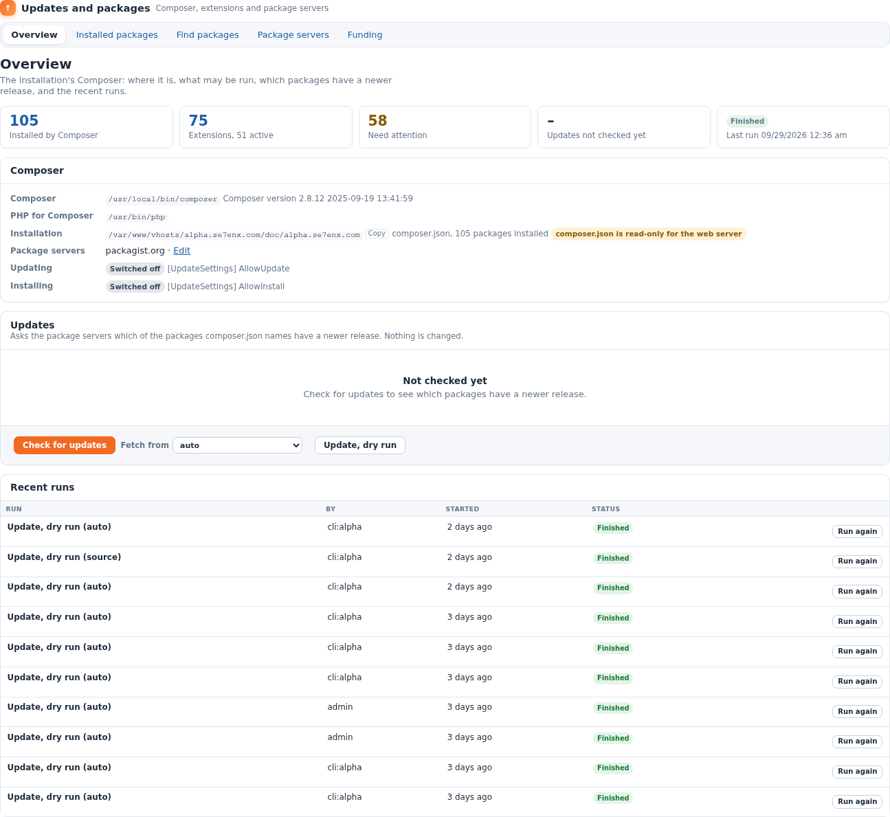
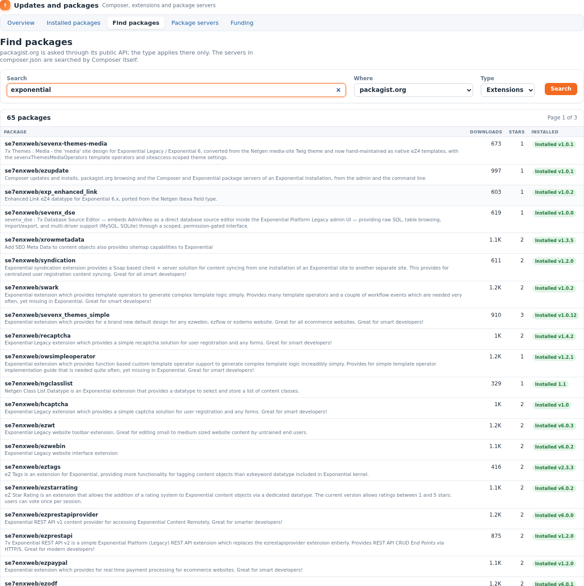
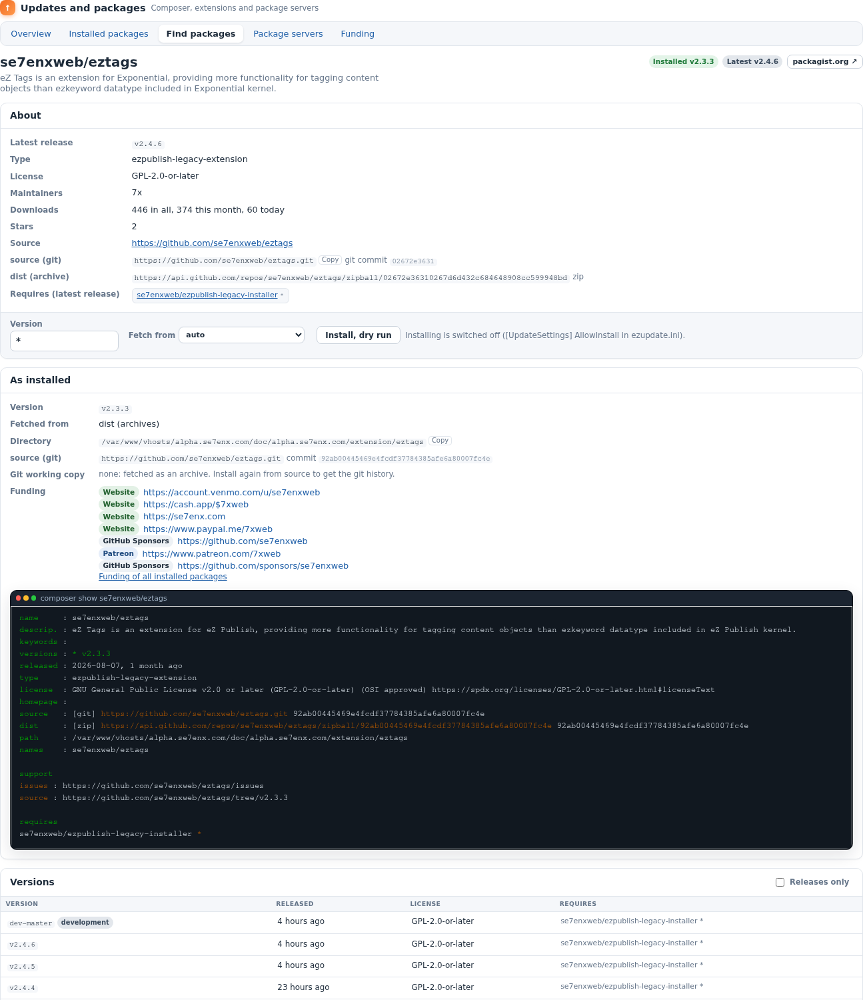
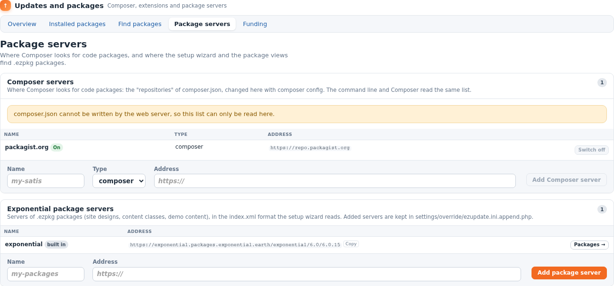
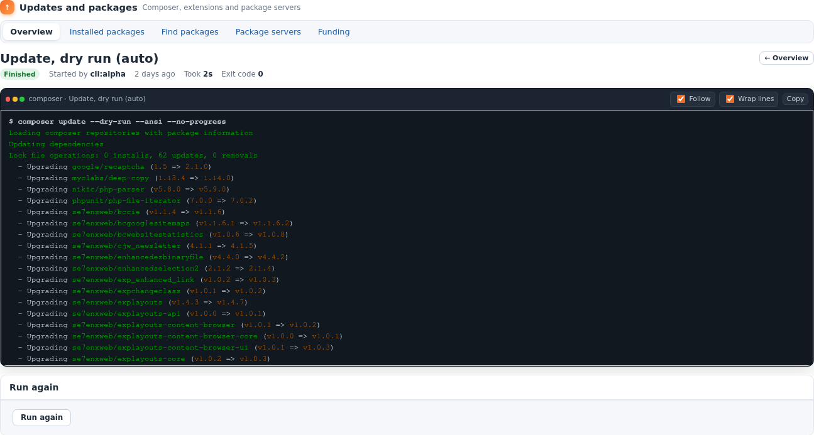
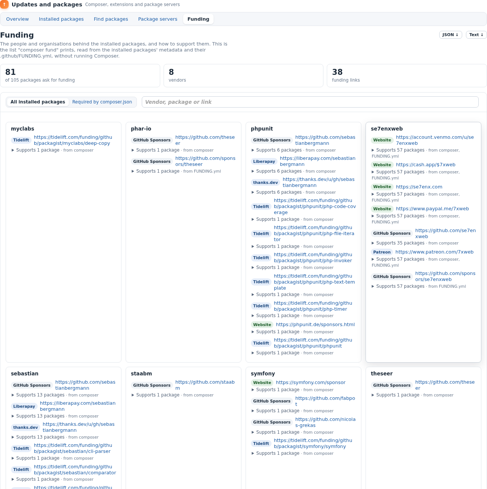

User guide
==========

eZ Update lives in the admin: **Setup** tab, **Updates and packages**. Five tabs
along the top take you through it. This guide walks through each, and through
the everyday jobs: checking for updates, a dry run, updating, installing a new
extension, adding a package server.

Throughout the pages:

- press **`/`** to jump to the page's search field, **`Escape`** to clear it;
- **Copy** next to a path or an address puts it on the clipboard;
- times read *3 days ago*; hover for the exact date;
- tables become cards when the column is narrow, so nothing scrolls sideways.

Overview
--------

`update/dashboard` — the state of the installation's Composer.

**The cards** count the packages Composer installed, the extensions (and how
many are active), what *needs attention* (opens the Installed packages view on
that filter), the packages with a newer release (after a check), and the last
run with its result.

**Composer** lists:

- the Composer binary and its version, or *Not found* / *Does not start* with
  Composer's own message;
- the PHP that runs it and the background runs;
- the installation's root, and whether `composer.json` can be written by the web
  server (needed for installs and server changes);
- the package servers (packagist.org on or off, and how many more);
- whether **Updating** and **Installing** are allowed
  (`[UpdateSettings] AllowUpdate`, `AllowInstall`).

**Updates** — *Check for updates* asks the package servers which of the packages
`composer.json` names have a newer release (`composer outdated --direct`).
Nothing is changed. Each result says whether the newer release is *Within the
constraint* (a `composer update` would take it) or *Needs a new constraint*
(raise it in `composer.json` first, for example from the package page).

Under the list:

- **Fetch from** — how packages are fetched for this run: *dist* (release
  archives, fast), *source* (git clones with history) or *auto* (Composer
  decides: source for development versions, dist for releases).
- **Preview (dry run)** — `composer update --dry-run`: what would change, in a
  run you can follow. Always safe.
- **Install updates** — runs `composer update` for the ticked packages. After
  *Check for updates* every package that an update can install has a tick box
  (all ticked); the *Kind* column says **Can be installed** or **Blocked by
  composer.json (constraint)**. Blocked packages have no tick box: raise their
  constraint in composer.json first. The button is always on the page. While
  updating is switched off (the default) it is disabled and the text under it says
  why (Composer rewrites `vendor/`; make a backup) and how to switch it on. With the
  `update/manage` policy, **Switch on updates** writes `AllowUpdate=enabled` to
  `settings/override/ezupdate.ini.append.php` (password again when
  `[AuditConsoleSettings] ReauthForManage` is on; recorded in the audit log) and
  **Switch off** reverses it. When updating is on, tick *A backup of files and
  database exists* to enable *Install updates*.

**Recent runs** — the last ten, from the admin and from the command line: what,
who, when, how it ended. *Run again* repeats a dry run at once; a run that
changes the installation opens its page, where you confirm the backup again.

Installed packages
------------------

`update/installed` — everything installed, matched up and checked. It has its
own guide: [INSTALLED_PACKAGES.md](INSTALLED_PACKAGES.md).

Find packages
-------------

`update/browse` — search for packages to install.

- **Search** — a name, a keyword or a vendor.
- **Where** — *packagist.org* (through its public API, with downloads and stars)
  or *Every server in composer.json* (Composer's own `composer search`, which
  also covers private repositories).
- **Type** — *Extensions* (`ezpublish-legacy-extension`, the default),
  *Kernel*, *Libraries* or *Any type* (packagist.org only; configurable in
  `[PackagistSettings] Types`).

Results show each package's description, its downloads and stars (shortened:
*12.3K*; hover for the exact number), whether it is abandoned, and the version
you have installed. Click a name for its page.

### A package's page

- **About** — latest release, type, license, maintainers, downloads, stars,
  source repository, website, the git URL and commit of the latest release, the
  archive URL, and what it requires.
- **Install** — choose a version (type a constraint such as `^2.4`, or pick one
  from the list), how to fetch it, then *Install, dry run*. When installing is
  allowed, confirm the backup and *Install* (or *Change version* for a package
  you have).
- **As installed** — the installed version, dist or source, the directory, the
  commit, and for a git working copy its branch, commit, tag, last commit and
  whether it has local changes; plus who the package asks to be funded by, and
  `composer show`'s full output.
- **Versions** — every release with its date, license and requirements;
  *Releases only* hides development versions. The installed one is marked.

A package that packagist.org does not know (from a private server in
`composer.json`) still gets the install form.

Package servers
---------------

`update/servers` — where packages come from.

### Composer servers

The `repositories` of `composer.json`: the same list Composer and the command
line read, changed with `composer config`, so nothing can drift apart.

- **packagist.org** — *Switch off* for an installation that must only use your
  own servers; *Switch on* to bring it back.
- **Add** — a name, a type (`composer` for a Composer repository such as Satis
  or Private Packagist, `vcs` or `git` for a single repository) and an
  `https://` address.
- **Remove** — only for named entries; unnamed ones are edited in
  `composer.json` itself.

If `composer.json` is read-only for the web server, the list is shown and the
buttons are off.

### Exponential package servers

Servers of `.ezpkg` packages (site designs, content classes, demo content) in
the `index.xml` format the setup wizard reads. The wizard's own server
(`package.ini [RepositorySettings]`) is always listed; added ones are kept in
`settings/override/ezupdate.ini.append.php`.

**Packages** opens a server's list: each package with its type and, when you
have it, the version in the local package repository. **Fetch** downloads a
package into that repository (**Fetch again** replaces it); install it from
there with the kernel's package views (Setup, Packages). Filter the list as you
type.

A run
-----

`update/job/<id>` — what Composer is doing, as it does it.

Updates and installs run in the background, one at a time, so they never hit a
web request's time limit and you can close the page. The page shows:

- the status (*Waiting*, *Running*, *Finished*, *Failed*, *Stopped*), who
  started it, when, how long it took (counting while it runs) and Composer's
  exit code;
- Composer's output in colour, refreshed every second. **Follow** keeps the
  newest line in view; **Wrap lines** switches line wrapping; **Copy** copies
  the whole output.

If the page cannot follow the run it says why: signed out, no permission, a
server error, no answer. The run itself goes on on the server.

When it has ended: **Run again**, and for a dry run **Run it for real** (with
the backup confirmation, when changes are allowed).

After a successful update or install the commands in
`[JobSettings] AfterRunCommands` run: by default the autoload array is
regenerated and the INI, template and content caches cleared.

Funding
-------

`update/fund` — the people and organisations behind your packages, and how to
support them: the list `composer fund` prints, read from each installed
package's `funding` metadata and its `.github/FUNDING.yml`, without running
Composer.

Choose *All installed packages* or *Required by composer.json*, filter by vendor,
package or link, download as JSON or text. Each link shows which of your
packages it supports.

Everyday recipes
----------------

**"Is anything out of date?"** Overview → *Check for updates*.

**"What would an update do?"** Overview → *Update, dry run* → read the run.

**"Update everything."** Allow updating (once, in the settings), take a backup,
Overview → *Update, dry run* → on its page *Run it for real* with the backup box
ticked.

**"Install an extension."** Find packages → search → the package → choose a
version → *Install, dry run* → *Run it for real*. Then switch it on
(`ActiveExtensions`) and check it on Installed packages.

**"Why does this extension not work?"** Installed packages → search its name →
open the row: is it installed, at the version you expect, switched on where you
need it?

**"Use only our own packages."** Package servers → add your Composer server →
switch packagist.org off.

**"Give me the list for the ticket."** Installed packages → *Needs attention* →
CSV.
